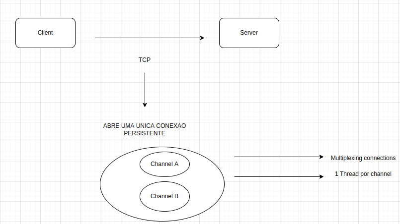
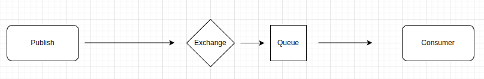
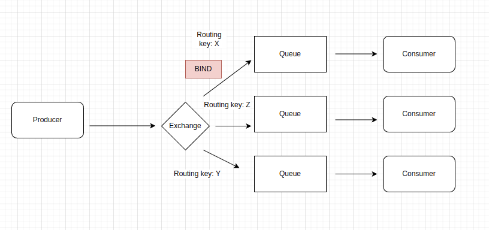
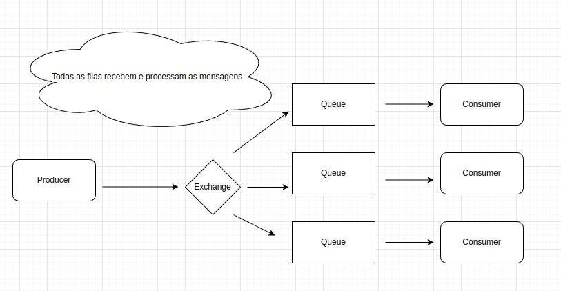

# Sobre o RabbitMQ

- Message Broker

- Implementa AMQP, MQTT, STOMP e HTTP

- Desenvolvido em Erlang

- Desacoplamento entre services

- Rapido e poderoso (as mensagens por default cai na memoria)

- Default de mercado

## Por baixo dos panos

  

## Funcionamento Basico

  

 ### Tipos de Exchange

- Direct

- Fanout (todas as filas que estao relacionadas a essa exchange)

- Topic

- Headers (menos utilizados)

#### Exemplos

### Direct Exchange

  

- BIND (processo de relacionar exchange cm a fila)

- Routing key (marca o exchange como X e a routing key X vai para fila X)

### Fanout Exchange

  

