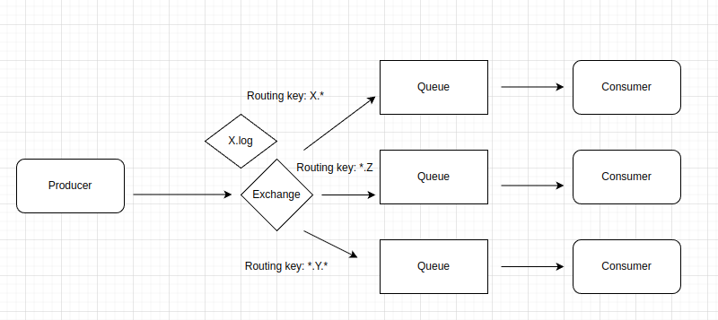

# Sobre o RabbitMQ

- Message Broker

- Implementa AMQP, MQTT, STOMP e HTTP

- Desenvolvido em Erlang

- Desacoplamento entre services

- Rapido e poderoso (as mensagens por default cai na memoria)

- Default de mercado

## Por baixo dos panos

  

## Funcionamento Basico

  

 ### Tipos de Exchange

- Direct

- Fanout (todas as filas que estao relacionadas a essa exchange)

- Topic

- Headers (menos utilizados)

#### Exemplos

### Direct Exchange

  

- BIND (processo de relacionar exchange cm a fila)

- Routing key (marca o exchange como X e a routing key X vai para fila X)

### Fanout Exchange

  

### Topic Exchange

  

## Queues

- FIFO, First In, First Out

- Propriedades:
  - Durable: Se ela deve ser salva mesmo depois do restart do broker
  - Auto-delete: Removida automaticamente quando o consumer se desconecta
  - Expiry: Define o tempo que nao ha mensagens ou clientes
  - Message TTL: tempo de vida da mensagem
  - Overflow:
    - Drop head (remova a ultima)
    - Reject publish
  - Exclusive: Somente channel que criou piode acessar
  - Max Length ou bytes: Quantidade de mensagens o tamanho dem butes maximo permitido

## Dead letter queues

- Algumas mensagens nao conseguem ser entregues por qualquer motivo

- Sao encaminhadas para uma exchange especifica que roteia as mensagens para uma dead letter queue

- Tais mensagens podem ser consumidas e averiguadas posteriormente